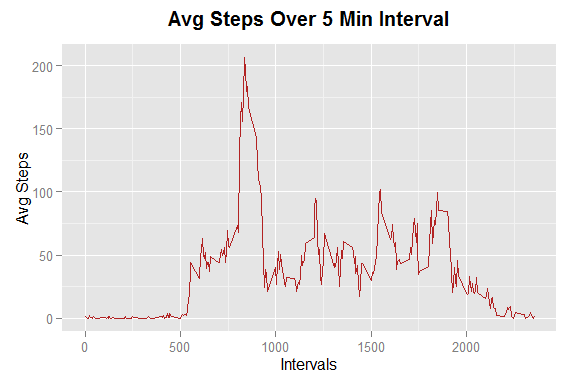
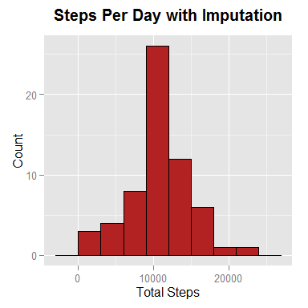

# Reproducible Research: Peer Assessment 1

## Loading and preprocessing the data

Specify global options


```r
library(knitr)
opts_chunk$set(echo = TRUE, warning = FALSE)
options(scipen = 7)
```

Setup the working directory


```r
setwd("D:/Work/Copy/R Workspaces/Programs/R Markdown/coursera_rr_a01")
```

Let's load the required libraries


```r
library(dplyr)
```

```
## 
## Attaching package: 'dplyr'
## 
## The following object is masked from 'package:stats':
## 
##     filter
## 
## The following objects are masked from 'package:base':
## 
##     intersect, setdiff, setequal, union
```

```r
library(ggplot2)
library(readr)
```

Let's import the data from the zip file directly and display the top 6
observations.


```r
df <- read.csv(unz("activity.zip", "activity.csv"), header = T,
               stringsAsFactors = FALSE)

head(df)
```

```
##   steps       date interval
## 1    NA 2012-10-01        0
## 2    NA 2012-10-01        5
## 3    NA 2012-10-01       10
## 4    NA 2012-10-01       15
## 5    NA 2012-10-01       20
## 6    NA 2012-10-01       25
```

Check the metadata and display some summary statistics


```r
str(df)
```

```
## 'data.frame':	17568 obs. of  3 variables:
##  $ steps   : int  NA NA NA NA NA NA NA NA NA NA ...
##  $ date    : chr  "2012-10-01" "2012-10-01" "2012-10-01" "2012-10-01" ...
##  $ interval: int  0 5 10 15 20 25 30 35 40 45 ...
```

```r
summary(df)
```

```
##      steps            date              interval     
##  Min.   :  0.00   Length:17568       Min.   :   0.0  
##  1st Qu.:  0.00   Class :character   1st Qu.: 588.8  
##  Median :  0.00   Mode  :character   Median :1177.5  
##  Mean   : 37.38                      Mean   :1177.5  
##  3rd Qu.: 12.00                      3rd Qu.:1766.2  
##  Max.   :806.00                      Max.   :2355.0  
##  NA's   :2304
```

The date column needs to be converted into date format from the character
format.


```r
df$date2 <- as.Date(df$date)
str(df)
```

```
## 'data.frame':	17568 obs. of  4 variables:
##  $ steps   : int  NA NA NA NA NA NA NA NA NA NA ...
##  $ date    : chr  "2012-10-01" "2012-10-01" "2012-10-01" "2012-10-01" ...
##  $ interval: int  0 5 10 15 20 25 30 35 40 45 ...
##  $ date2   : Date, format: "2012-10-01" "2012-10-01" ...
```

Drop the character column and rename date2 to date.


```r
df$date <- NULL
colnames(df)[3] <- "date"
head(df)
```

```
##   steps interval       date
## 1    NA        0 2012-10-01
## 2    NA        5 2012-10-01
## 3    NA       10 2012-10-01
## 4    NA       15 2012-10-01
## 5    NA       20 2012-10-01
## 6    NA       25 2012-10-01
```

## What is mean total number of steps taken per day?

Compute total number of steps taken per day and save it in a new dataset.


```r
total_steps_per_day <- group_by(.data = df, date) %>%
    summarise(total_steps = sum(steps, na.rm = TRUE))

total_steps_per_day
```

```
## Source: local data frame [61 x 2]
## 
##          date total_steps
## 1  2012-10-01           0
## 2  2012-10-02         126
## 3  2012-10-03       11352
## 4  2012-10-04       12116
## 5  2012-10-05       13294
## 6  2012-10-06       15420
## 7  2012-10-07       11015
## 8  2012-10-08           0
## 9  2012-10-09       12811
## 10 2012-10-10        9900
## ..        ...         ...
```

Generate a histogram of steps taken per day.


```r
ggplot(total_steps_per_day, aes(total_steps)) +
    geom_histogram(binwidth = 3000, color = 'black',
                   fill = 'firebrick') +
    ggtitle('Steps Per Day') +
    theme(plot.title = element_text(size = 15, face = 'bold',
                                    vjust = 2)) +
    labs(x = "Total Steps", y = "Count")
```

 

Lets compute the mean and median number of steps taken per day.


```r
avg_steps <- round(mean(total_steps_per_day$total_steps, na.rm = TRUE), 1)
avg_steps
```

```
## [1] 9354.2
```

```r
med_steps <- round(median(total_steps_per_day$total_steps, na.rm = TRUE), 1)
med_steps
```

```
## [1] 10395
```

The average number of steps taken per day is **9354.2** and the median
number of steps taken per day is **10395**.

## What is the average daily activity pattern?

Aggregate total steps taken at 5 min intervals averaged across days


```r
avg_steps_per_interval <- group_by(.data = df, interval) %>%
    summarise(avg_steps = mean(steps, na.rm = TRUE))

avg_steps_per_interval
```

```
## Source: local data frame [288 x 2]
## 
##    interval avg_steps
## 1         0 1.7169811
## 2         5 0.3396226
## 3        10 0.1320755
## 4        15 0.1509434
## 5        20 0.0754717
## 6        25 2.0943396
## 7        30 0.5283019
## 8        35 0.8679245
## 9        40 0.0000000
## 10       45 1.4716981
## ..      ...       ...
```

Generate a time series plot of average number of steps taken over 5-minute
intervals.


```r
ggplot(avg_steps_per_interval, aes(x = interval, y = avg_steps)) +
    geom_line(colour = "firebrick") + 
    ggtitle("Avg Steps Over 5 Min Interval") +
    theme(plot.title = element_text(size = 15, face = 'bold',
                                    vjust = 2)) +
    labs(x = "Intervals", y = "Avg Steps")
```

 

Let's compute which 5-minute interval on average has the maximum number of 
steps


```r
max_step_row <- top_n(x = avg_steps_per_interval, 1, wt = avg_steps)

max_step_row$interval
```

```
## [1] 835
```

The 5-minute interval with the maximum number of steps on an average is 
835.

## Imputing missing values

Compute the number of rows with missing values.


```r
# Computing only for steps, since interal and date does not have missing
nrow_miss <- length(which(is.na(df$steps)))

nrow_miss
```

```
## [1] 2304
```

There are 2304 rows missing value. We can try imputing the missing
with average of the corresponding 5-minute intervals across all other days.
We have already calculated the average in the table **avg_steps_per_interal**.
We can merge **avg_steps_per_interal** with **df** on **interval** and replace
missing values with **avg_steps**.


```r
df2 <- df %>% left_join(avg_steps_per_interval)
```

```
## Joining by: "interval"
```

```r
# Check the output dataset
head(df2)
```

```
##   steps interval       date avg_steps
## 1    NA        0 2012-10-01 1.7169811
## 2    NA        5 2012-10-01 0.3396226
## 3    NA       10 2012-10-01 0.1320755
## 4    NA       15 2012-10-01 0.1509434
## 5    NA       20 2012-10-01 0.0754717
## 6    NA       25 2012-10-01 2.0943396
```

```r
# Replace missing steps with avg_steps
df2$steps <- ifelse(is.na(df2$steps), df2$avg_steps, df2$steps)

# Check the output dataset
head(df2)
```

```
##       steps interval       date avg_steps
## 1 1.7169811        0 2012-10-01 1.7169811
## 2 0.3396226        5 2012-10-01 0.3396226
## 3 0.1320755       10 2012-10-01 0.1320755
## 4 0.1509434       15 2012-10-01 0.1509434
## 5 0.0754717       20 2012-10-01 0.0754717
## 6 2.0943396       25 2012-10-01 2.0943396
```

```r
# Check if any missing value remains
which(is.na(df2))
```

```
## integer(0)
```

```r
# Drop avg_steps
df2$avg_steps <- NULL
```

Recomputing total steps per day, generating histograms and computing mean and 
median of total number of steps taken per day.


```r
# Compute total steps
total_steps_per_day2 <- group_by(.data = df2, date) %>%
    summarise(total_steps = sum(steps, na.rm = TRUE))

# Display top 10 rows
total_steps_per_day2
```

```
## Source: local data frame [61 x 2]
## 
##          date total_steps
## 1  2012-10-01    10766.19
## 2  2012-10-02      126.00
## 3  2012-10-03    11352.00
## 4  2012-10-04    12116.00
## 5  2012-10-05    13294.00
## 6  2012-10-06    15420.00
## 7  2012-10-07    11015.00
## 8  2012-10-08    10766.19
## 9  2012-10-09    12811.00
## 10 2012-10-10     9900.00
## ..        ...         ...
```

```r
# Generate a histogram of steps taken per day.
ggplot(total_steps_per_day2, aes(total_steps)) +
    geom_histogram(binwidth = 3000, color = 'black',
                   fill = 'firebrick') +
    ggtitle('Steps Per Day with Imputation') +
    theme(plot.title = element_text(size = 15, face = 'bold',
                                    vjust = 2)) +
    labs(x = "Total Steps", y = "Count")
```

 

```r
# Lets recompute the mean and median number of steps taken per day.
avg_steps2 <- round(mean(total_steps_per_day2$total_steps, na.rm = TRUE), 1)
avg_steps2
```

```
## [1] 10766.2
```

```r
med_steps2 <- round(median(total_steps_per_day2$total_steps, na.rm = TRUE), 1)
med_steps2
```

```
## [1] 10766.2
```

The earlier mean and median values of number of steps taken per day were 
**9354.2** and **10395** respectively. Due to imputation, the 
mean and the median number of steps per day have increased to **10766.2**
and **10766.2** respectively.

## Are there differences in activity patterns between weekdays and weekends?
