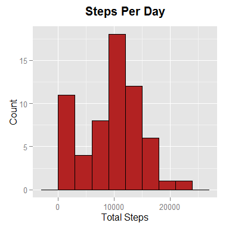

# Reproducible Research: Peer Assessment 1

## Loading and preprocessing the data

Specify global options


```r
library(knitr)
opts_chunk$set(echo = TRUE, warning = FALSE)
```

Setup the working directory


```r
setwd("D:/Work/Copy/R Workspaces/Programs/R Markdown/coursera_rr_a01")
```

Let's load the required libraries


```r
library(dplyr)
```

```
## 
## Attaching package: 'dplyr'
## 
## The following object is masked from 'package:stats':
## 
##     filter
## 
## The following objects are masked from 'package:base':
## 
##     intersect, setdiff, setequal, union
```

```r
library(ggplot2)
library(readr)
```

Let's import the data from the zip file directly and display the top 10
observations.


```r
df <- read.csv(unz("activity.zip", "activity.csv"), header = T,
               stringsAsFactors = FALSE)

head(df)
```

```
##   steps       date interval
## 1    NA 2012-10-01        0
## 2    NA 2012-10-01        5
## 3    NA 2012-10-01       10
## 4    NA 2012-10-01       15
## 5    NA 2012-10-01       20
## 6    NA 2012-10-01       25
```

Check the metadata and display some summary statistics


```r
str(df)
```

```
## 'data.frame':	17568 obs. of  3 variables:
##  $ steps   : int  NA NA NA NA NA NA NA NA NA NA ...
##  $ date    : chr  "2012-10-01" "2012-10-01" "2012-10-01" "2012-10-01" ...
##  $ interval: int  0 5 10 15 20 25 30 35 40 45 ...
```

```r
summary(df)
```

```
##      steps            date              interval     
##  Min.   :  0.00   Length:17568       Min.   :   0.0  
##  1st Qu.:  0.00   Class :character   1st Qu.: 588.8  
##  Median :  0.00   Mode  :character   Median :1177.5  
##  Mean   : 37.38                      Mean   :1177.5  
##  3rd Qu.: 12.00                      3rd Qu.:1766.2  
##  Max.   :806.00                      Max.   :2355.0  
##  NA's   :2304
```

The date column needs to be converted into date format from the character
format.


```r
df$date2 <- as.Date(df$date)
str(df)
```

```
## 'data.frame':	17568 obs. of  4 variables:
##  $ steps   : int  NA NA NA NA NA NA NA NA NA NA ...
##  $ date    : chr  "2012-10-01" "2012-10-01" "2012-10-01" "2012-10-01" ...
##  $ interval: int  0 5 10 15 20 25 30 35 40 45 ...
##  $ date2   : Date, format: "2012-10-01" "2012-10-01" ...
```

Drop the character column and rename date2 to date.


```r
df$date <- NULL
colnames(df)[3] <- "date"
head(df)
```

```
##   steps interval       date
## 1    NA        0 2012-10-01
## 2    NA        5 2012-10-01
## 3    NA       10 2012-10-01
## 4    NA       15 2012-10-01
## 5    NA       20 2012-10-01
## 6    NA       25 2012-10-01
```

## What is mean total number of steps taken per day?

Compute total number of steps taken per day and save it in a new dataset.


```r
total_steps_per_day <- group_by(.data = df, date) %>%
    summarise(total_steps = sum(steps))

total_steps_per_day
```

```
## Source: local data frame [61 x 2]
## 
##          date total_steps
## 1  2012-10-01          NA
## 2  2012-10-02         126
## 3  2012-10-03       11352
## 4  2012-10-04       12116
## 5  2012-10-05       13294
## 6  2012-10-06       15420
## 7  2012-10-07       11015
## 8  2012-10-08          NA
## 9  2012-10-09       12811
## 10 2012-10-10        9900
## ..        ...         ...
```

Generate a histogram of steps taken per day.


```r
ggplot(total_steps_per_day, aes(total_steps)) +
    geom_histogram(binwidth = 3000, color = 'black',
                   fill = 'firebrick') +
    ggtitle('Steps Per Day') +
    theme(plot.title = element_text(size = 15, face = 'bold',
                                    vjust = 2)) +
    labs(x = "Total Steps", y = "Count")
```

 

Lets compute the mean and median number of steps taken per day.


```r
avg_steps <- mean(total_steps_per_day$total_steps, na.rm = TRUE)
avg_steps
```

```
## [1] 10766.19
```

```r
med_steps <- median(total_steps_per_day$total_steps, na.rm = TRUE)
med_steps
```

```
## [1] 10765
```

The average number of steps taken per day is 1.0766189\times 10^{4} and the median
number of steps taken per day is 10765.

## What is the average daily activity pattern?


## Imputing missing values


## Are there differences in activity patterns between weekdays and weekends?
